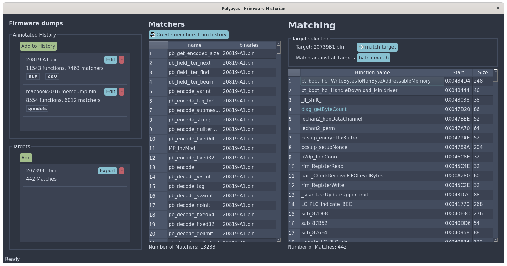

# Polypyus Firmware Historian
Polypyus learns to find functions in new binaries by extracting functions from binaries you have already analyzed - the way of the firmware historian.
Polypyus can find functions in binaries without even disassembling them. This ability is a huge advantage when disassembling your binaries is hard.
The Findings from this software can be exported for further use in other applications. For example, one can take the findings from Polypyus and use them as entry points for an interactive disassembler.

## How it works

Polypyus creates fuzzy binary matchers by comparing common functions
in your collection of annotated firmware-dumps / binaries.

Annotations can either be

* a patch ELF file - an ELF file containing only symbol definitions
* a symdefs file - as produced by arm compilers
* a CSV file - with a format as shown in the examples

and contain the address, size, and name of known functions.

The more related binaries are part of the history collection, the better. Given several slightly different functions, Polypyus finds very good matchers.

## How to install it

Polypyus requires Python 3 >= 3.6.
We advise the use of a virtualenv for the following installation.
Clone this repository and in this folder run

```bash
pip install .
```

## How to run it

After the installation, at your disposal are the commands:

* polypyus
* polypyus-cli

## Using Polypyus

Polypyus is available through a graphical and a command-line interface.
Both the GUI (polypyus) and the CLI (polypyus-cli) take these arguments during invocation:

```bash
  --verbose is the verbosity level. By default, it shows warnings -v shows info -vv show debug information.
  --project sets the location of the project file. This is either a file path or ":memory:".
  --help    Show help message.
```

The project option facilitates you to store your work for different contexts in different files
and also reopen them again.

### Using the GUI

In the GUI the general workflow goes from the left-hand side of the window to the right.
You add binaries to the history. Then add symbol-annotations to the entries in your history.
Afterward, you add target binaries and then hit "create matchers from history".
Once the matchers are created, you can select one of your targets and match against it or "batch match" against all targets.
Finally, you can export your findings as a CSV file.



### Using the CLI

The upside to using the CLI is its ability to be automated.
The downside is that compared to the GUI, there is less information available to you.
The output format of the CLI is subject to change.
With the warning out of the way here is an example of how to use it:

```bash
polypyus-cli --history examples/history/20819-A1.bin --annotation examples/history/20819-A1_patch.elf --history examples/history/20735B1.bin --annotation examples/history/20735B1_patch.elf --project test.sqlite
polypyus-cli --target examples/history/20739B1.bin --project test.sqlite
```

The first command creates "test.sqlite" as a new project file and import 20819-A1.bin and 20735B1.bin with their respective "patch.elf" files.
The second invocation reuses the same project file and matches against the binary 20739B1.bin.
For each command, the number of --history and --annotation needs to match.
You could combine the two commands in one but adding the --target argument to the first command.

## License

Polypyus is Open Source Licensed under the [GPLv3](LICENSE.txt).
