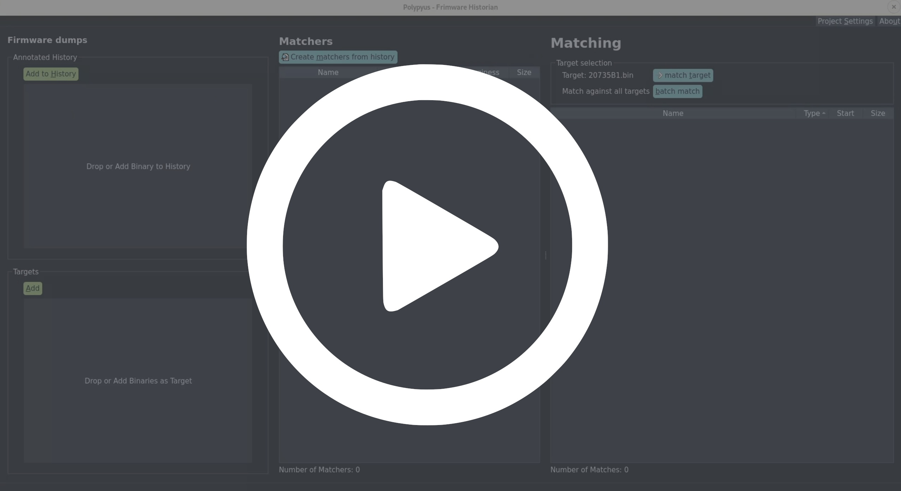

# Polypyus Firmware Historian
*Polypyus* learns to locate functions in raw binaries by extracting known functions from similar binaries.
Thus, it is a firmware historian. *Polypyus* works without disassembling these binaries, which is an advantage
for binaries that are complex to disassemble and where common tools miss functions. In addition, the binary-only
approach makes it very fast and run within a few seconds. However, this approach
requires the binaries to be for the same architecture and have similar compiler options.

*Polypyus* integrates into the workflow of existing tools like *Ghidra*, *IDA*, *BinDiff*, and *Diaphora*.
For example, it can import previously annotated functions and learn from these, and also export found functions to be
imported into *IDA*. Since *Polypyus* uses rather strict thresholds, it only found correct matches in our experiments.
While this leads to fewer results than in existing tools, it is a good entry point for loading these matches into
*IDA* to improve its auto analysis results and then run *BinDiff* on top.

## What Polypyus solves
When working on raw firmware binaries, namely various *Broadcom* and *Cypress* Bluetooth firmware versions,
we found that *IDA* auto analysis often identified function starts incorrectly. In *IDA Pro 6.8* the auto
analysis is a bit more aggressive, leading to more results but also more false positives. Overall, *IDA Pro 7.2*
was more pessimistic, but missed a lot of functions. This led to only a few *BinDiff* matches between our firmwares in
*IDA Pro 6.8* and no useful matches at all in *IDA Pro 7.2*.

Interestingly, *BinDiff* often failed to identify
functions that, except from branches, were byte-identical. Note that *Polypyus* searches exactly for these
byte-identical functions. We assume that *BinDiff* fails at these functions due to a different
call graph produced by missing functions and false positives. Sometimes, these functions were already recognized
by *IDA*, but often, *IDA* did either not recognize these as code or not mark them as function.
Note that *Diaphora* has similar problems, as it exports functions identified by *IDA* before further processing
them.

Moreover, while we found that *Amnesia* finds many functions, it also finds many
false positives. However, many functions have a similar stack frame
setup in the beginning. Thus, *Polypyus* has an option to learn common function starts from the annotated
input binaries and apply this to other binaries to identify functions without matching their name.
This optional step is only applied to the regions in which no functions were previously located,
this way the common function starts method and the main function finding do not conflict.

## How it works

*Polypyus* creates fuzzy binary matchers by comparing common functions
in a collection of annotated firmware binaries.

Currently, the following annotations are supported:

* A *WICED Studio* `patch.elf` file, which is a special ELF file containing only symbol definitions.
* A `.symdefs` file as it is produced by most ARM compilers.
* A `.csv` file with a format documented in the examples.

These annotations contain the address, size, and name of known functions.
The more commonalities the input binaries in the history collection have, the better for *Polypyus* performance
and results. Given several slightly different functions, *Polypyus* creates very good matchers.

## How to install it

*Polypyus* requires Python 3 >= 3.6.
We advise the use of a virtualenv for the following installation.
Clone this repository and in this folder run:

```bash
pip install .
```

## How to run it

After the installation the following commands are available:

* `polypyus-gui`
* `polypyus-cli`

## Using Polypyus

*Polypyus* is available through a graphical and a command-line interface.
Both, the GUI `polypyus-gui` and the CLI `polypyus-cli`, take these arguments during invocation:

```bash
  --verbose is the verbosity level. By default, it shows warnings -v shows info -vv show debug information.
  --project sets the location of the project file. This is either a file path or ":memory:".
  --help    Show help message.
```

The project option facilitates you to store your work for different contexts in different files
and also reopen them again.

### Using the GUI

The general GUI workflow goes from the left-hand side of the window to the right.
First, binaries are added to the history. Then, symbol annotations to the entries
in the history follow.
Afterward, target binaries can be added.
For the matching, hit `Create matchers from history`. Once the matchers are created, single targets
can be selected, or all targets can be matched by selecting `batch match`.
Finally, the findings can be exported to a `.csv` file.

In the following you can see a demo video where *Polypyus* only takes a few seconds to learn from two input
binaries, annotate them, create matchers, and apply matches to a new binary.

[](doc/gui_demo.mp4)


### Using the CLI

The upside to using the CLI is its ability to be automated.
As of now, the output format of the CLI is subject to change.
However, here is an example of calling it:

```bash
polypyus-cli --history examples/history/20819-A1.bin --annotation examples/history/20819-A1_patch.elf --history examples/history/20735B1.bin --annotation examples/history/20735B1_patch.elf --project test.sqlite
polypyus-cli --target examples/history/20739B1.bin --project test.sqlite
```

The first command creates `test.sqlite` as a new project file and imports `20819-A1.bin` and `20735B1.bin`
with their respective `patch.elf` files.
The second invocation reuses the same project file and matches against the binary `20739B1.bin`.
For each command, the number of `--history` and `--annotation` needs to match.
These two commands could also be combined into one by adding the `--target` argument to the first command.

### How does it work internally?

We will release a paper soon. Until then, you can take a look into 
[Jan's Master thesis final presentation](doc/jan_msc-final-presentation.pdf), which covers the issues encountered
when working with conventional binary diffing approaches in ARM Thumb2 mode, and how the alternate binary-only
approach works.

## Recommended IDA Workflow

After some internal testing, we can recommend the following workflow when working with *IDA Pro* and *Polypyus*:

* Create a fresh database. ARM v7 little endian, ARM Cortex M for the Bluetooth firmware.
* Mark position 0x0 as Thumb (`Alt-g`, `T=0x1`).
* Create ROM and RAM segments. ROM at `0x0` with `rx`, RAM at `0x200000` with `rwx` (at least for the Bluetooth firmware).
* Create vector table offsets in ROM, at least for the reset vector, which is a 4-byte offset at `0x4` (`o`).
  On the *CYW20735* firmware it points to `0x3bc+1`. Go back one byte and create a function (`p`).
* Wait for auto analysis to finish.
* Import *Polypyus* results.
* Run the [Thumbs Up](https://github.com/CheckPointSW/Karta/blob/master/src/thumbs_up/thumbs_up_firmware.py) scripts.
* Run both [BinDiff](https://www.zynamics.com/bindiff.html) and [Diaphora](http://diaphora.re/).
  The latter ideally in an IDA version with decompiler. Use both, as they use different heuristics.

...now your IDA database might be somewhat useful :) Still a lot of things the disassembler
fails at within ARM Thumb2 but way better than anything IDA does on its own.


## Broadcom Bluetooth firmware history

The `examples` folder contains various firmware with and without symbols.
Everything in the [history](examples/history) contains symbols, everything in [targets](examples/targets) is without symbols.

##### History

| Chip       | Device                      | Build Date  | Symbols |
| ---------- | --------------------------- | ----------- | ------- |
| BCM20703A2 | MacBook/iMac 2016-2017      | Oct 22 2015 | ✔       |
| CYW20719B1 | Evaluation board            | Jan 17 2017 | ✔       |
| CYW20735B1 | Evaluation board            | Jan 18 2018 | ✔       |
| CYW20819A1 | Evaluation board            | May 22 2018 | ✔       |

##### Targets

| Chip       | Device                      | Build Date  | Symbols |
| ---------- | --------------------------- | ----------- | ------- |
| BCM2046A2  | iMac Late 2009              |       2007? | -       |
| BCM2070B0  | MacBook 2011, Thinkpad T420 | Jul 9 2008  | -       |
| BCM20702A1 | Asus USB Dongle             | Feb (?) 2010 | -      |
| BCM4345B0  | iPhone 6                    | Jul 15 2013 | -       |
| BCM4335C0  | Google Nexus 5              | Dec 11 2012 | -       |
| BCM4345B0  | Google Nexus 6P / Galaxy S6 | Oct 23 2014 | -       |
| BCM43430A1 | Raspberry Pi 3 and Zero W   | Jun  2 2014 | -       |
| BCM4345C0  | Raspberry Pi 3+ and 4       | Aug 19 2014 | -       |
| BCM4347B0  | Samsung Galaxy S8 series    | Jun  3 2016 | -       |
| BCM4375B1  | Samsung Galaxy S10/20 series| Apr 13 2018 | -       |
| BCM4378B1  | iPhone 11/SE2               | Oct 25 2018 | Strings |

For the Samsung series, S8 also includes the Note 8 and S8+ etc., and the
S10/S20 also includes everything from the S10e up to the Note 20 5G.

Dump quality might vary, some are with RAM and some are just the ROM.
We have access to most of the devices in this list. If you need a dump with
most recent patch levels and including RAM, feel free to ping us.

A few devices mentioned in the paper are not included here, since these might
not be research-only devices etc. A few iPhones and MacBooks are missing as well,
since we have them as research-only devices but the original dump wasn't. These
devices will be added soon :)


## License & Credits

We thank Anna Stichling for creating the *Polypyus* logo.
We also thank Christian Blichmann and Joxean Koret for their feedback.

*Polypyus* is open-source and licensed under the [GPLv3](LICENSE.txt).
